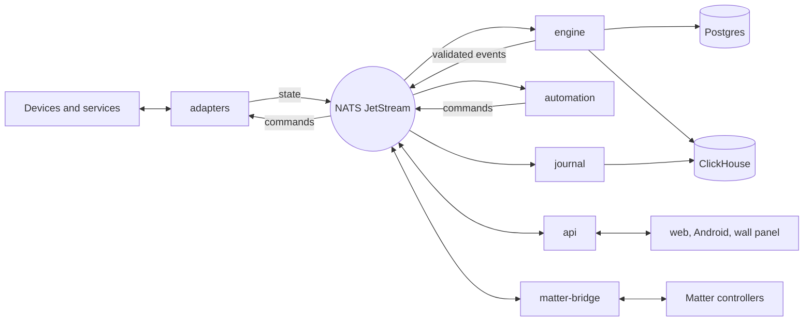

# DIDA — Architecture

DIDA is a rigid core surrounded by isolated adapters. The core knows canonical
capabilities (on/off, brightness, temperature and the like) and never a
protocol; each adapter is its own process that translates one protocol or
service into those capabilities. A message bus separates the two, and every
state update is validated at that boundary, so a misbehaving device can only
take its own adapter down.

## Principles

- **Capabilities, not protocols.** The engine, the automations and the
  interface work with capabilities. Only an adapter knows Zigbee, MQTT or a
  vendor's cloud.
- **One adapter, one process.** An adapter that hangs, leaks or crashes stops
  on its own: its entities go unavailable and the rest of the house carries
  on. The container runtime starts it again.
- **Validation at the boundary fails loud.** A malformed or out-of-range state
  update is rejected, logged and counted; it never reaches the house's state.
- **Adapters hold nothing.** An adapter has no database access. Its settings,
  secrets and the house's records reach it through a sealed request to the
  API, so a compromised adapter cannot read another one's secrets.
- **The logic stays out of the engine.** Automations run in their own process,
  and scripted logic in a Starlark sandbox, so a runaway rule cannot stall
  state processing.
- **A plain CPU is enough.** DIDA does no vision of its own; it mirrors what
  BABA sees.

## Components

| Component | Role |
|---|---|
| `adapters/*` | One package and one container per protocol or service (Zigbee through zigbee2mqtt, Shelly, ESPHome, HomeKit, Cast, SmartThings, Tuya, BABA, OPUS and others) |
| `engine` | Validates state updates against the capability spec, keeps the current state and its history, publishes validated events |
| `automation` | Typed rules (trigger, condition, action) and the Starlark sandbox, each rule behind its own circuit breaker |
| `journal` | Discrete device events (a button press, a doorbell ring) into history |
| `api` | REST and a live WebSocket, authentication, the configuration broker for adapters, people and presence, notifications |
| `ui` | SvelteKit interface: the floor plan, devices, automations, history, settings |
| `matter-bridge` | Exposes DIDA's entities as Matter devices, for voice assistants on the local network |
| `runner` | Switches adapters on and off from the interface; the only container with the Docker socket |
| `netmgr`, `lanprobe` | Presence on the IoT VLANs through macvlan networks, and the host's own network facts |
| `planvision` | Turns a floor-plan image into room polygons |
| `keys` | Derives every service's bus, broker and database credentials from one secret at start |
| `nats` | Message bus with JetStream |
| `postgres`, `clickhouse` | System of record and history |
| `android/` | The companion app (location, notifications, the house on the phone) and a car app |

## Data flow



A command's path: the interface asks the API, the API publishes it on
`dida.command.<adapter>.<entity>`, and the adapter speaks the device's protocol. The
device's answer comes back as a state update on `dida.state.*`; the engine
validates it, writes the current state to Postgres and the change to
ClickHouse, and publishes the validated event. The API pushes it to every
open browser, and the automation engine matches it against the rules.

State, events and commands travel through JetStream streams with durable
consumers, so the engine and the automations pick up where they left off
after a restart, and every command is kept for the audit trail.

## Storage

| Store | Holds |
|---|---|
| Postgres | Entities and their current state, rooms and floor plans, automations, people, users, settings and adapter configuration (secrets encrypted) |
| ClickHouse | State history, device events, command history, alerts and application logs |
| JetStream | State and event streams in flight |
| `state/` on disk | Derived keys, floor-plan images, adapter working files |

Postgres schema changes are numbered SQL files in `db/migrations`, ClickHouse
ones in `ch/migrations`. Every service that touches the database applies
pending migrations at start, serialised by an advisory lock.

## Interfaces

- **HTTP API** under `/api`, and a WebSocket with live state, both reached
  through the web interface's own proxy.
- **Message bus** subjects under `dida.*`: `state`, `entity`, `command`,
  `events`, `journal`, `cfg` (the configuration broker), `heartbeat` and
  `logs`. Every service has its own bus identity.
- **BABA** pushes each camera's state (occupied zones, what is in view, scene
  states) onto DIDA's bus; the BABA adapter mirrors it without deriving
  anything and switches camera lights through BABA's API as a peer.
- **OPUS** Player's outputs (its television app and its DAC) are media
  entities; the OPUS adapter hands the house's orders to the Player, the same
  way the Player's own screens do.
- **Other DIDA installations** can be mirrored into this one with the peer
  adapter, so a second house appears beside the first.
- **Matter** controllers adopt DIDA's entities locally, with no cloud account.

## Security

Users sign in with a password (Argon2) and receive a session cookie; the
companion app pairs by scanning a setup QR code. Adapter secrets are
encrypted in Postgres and reach the adapter only through the sealed broker.
Each service logs in to Postgres as a role limited to what it needs, and the
superuser stays with Postgres and the key service. DIDA serves plain HTTP and
expects TLS from a tunnel or reverse proxy in front of it.

## Deployment

Everything runs in containers from one `docker-compose.yml`. Every adapter is
its own compose profile; the runner switches profiles on request from the
interface, so enabling an integration never means editing files by hand.
`install.sh` writes `.env` and starts the stack; `deploy/upgrade.sh` fetches
the latest code, rebuilds and restarts, and the same script serves every
installation. Steps between releases are in [UPGRADE.md](UPGRADE.md).

## Extending

- **An adapter:** a package in `adapters/` that implements the protocol in
  `core/src/dida_core/adapter.py`, started by the shared adapter runner, its
  settings form declared in `core/src/dida_core/adapter_config.py`, and a
  compose service under its own profile.
- **A capability:** its spec in `core/src/dida_core/capabilities.py`; the
  engine validates against it and the interface renders it.
- **Logic:** a typed automation in the interface, or a Starlark script when
  the logic outgrows it.

## Repository layout

```
core/         dida_core: capabilities, bus, adapter protocol, automations;
              home_core (shared with BABA)
adapters/     one package per protocol or service
services/     engine, automation, journal, api, matter-bridge, runner,
              netmgr, planvision
ui/           SvelteKit interface
android/      companion app and car app
db/, ch/      Postgres and ClickHouse migrations
docker/       base images
deploy/       deployment to own installations, upgrade, demo
scripts/      maintenance
tests/        test suite
install.sh    installer
```
