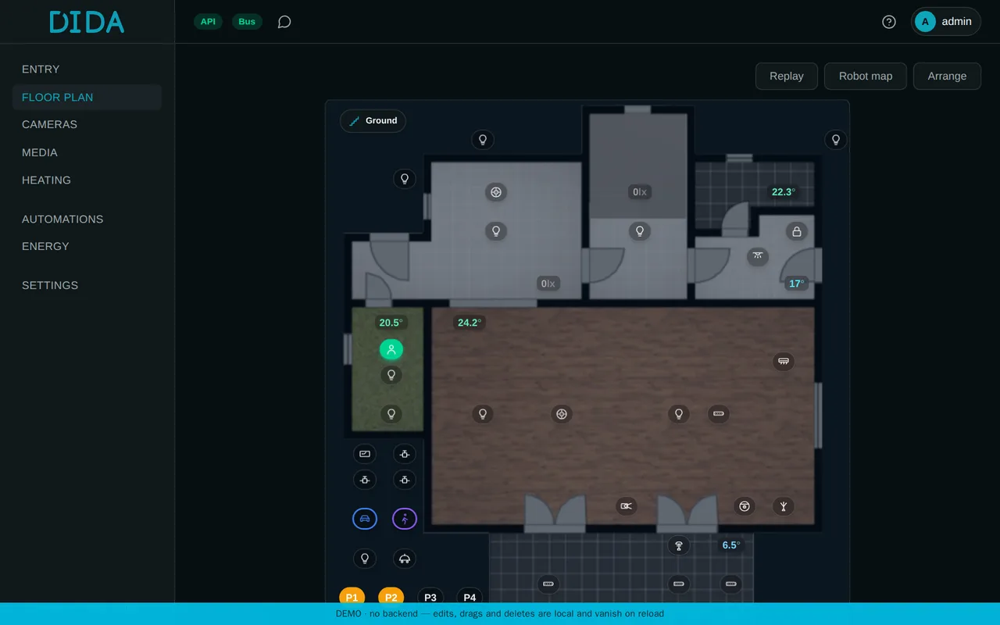
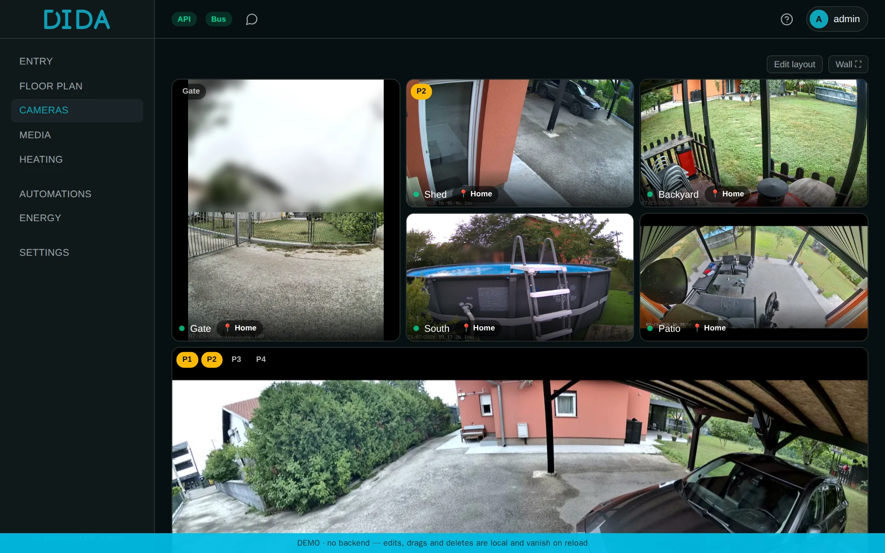
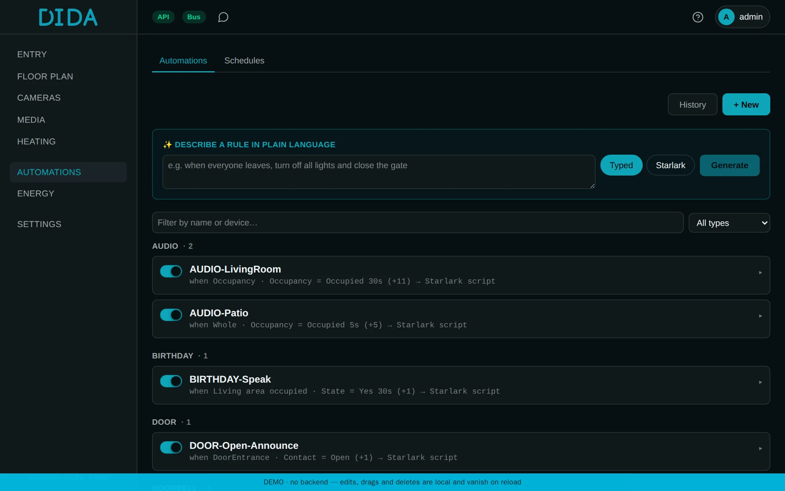
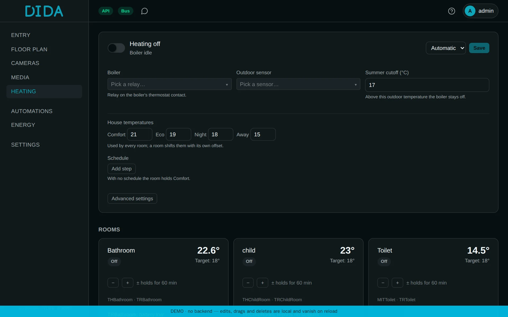

# DIDA — Distributed Isolated Device Automation

**A smart-home system built to survive its own devices.**

*Dida* is Dalmatian for grandpa: the one who has done his rounds before anyone
is awake. The boiler comes on at the right time, the shutters go up as the sun
clears the hill, and the lights go off behind everyone. DIDA runs a house the
same way. It is the sibling of [BABA](https://github.com/Bacinac/baba): BABA at
the window sees everything, DIDA keeps the house running.

**Try it:** [demo-dida.boskovic.biz](https://demo-dida.boskovic.biz), the real interface with a made-up household inside.

<p align="center"></p>

<details>
<summary>More screenshots</summary>

**Floor plan:** the house controlled from its own plan, with who is at home.


**Cameras:** in the same interface as the lights and the heating.



**Automations:** grouped by what they do, each a typed rule or a Starlark script.



**Heating:** per room, with comfort, eco and night temperatures.



</details>

## What it does

It keeps every device in the house in hand through isolated adapters, from
light bulbs and door locks to the lawn mower, the amplifier and the weather
station. The house is controlled from its own floor plan. Automations do the
everyday work: lights go off behind people, the radio follows the remote, the
washing machine reports when it is done. For the serious logic there is a
Starlark sandbox that cannot hang the core. Voice control comes in through a
Matter bridge, the family through its own Android app with location, and a wall
panel shows the floor plan. Every state change and every command is recorded.

## What sets it apart

Every protocol and every integration runs in its own process behind a message
bus, and every state is validated at the boundary, so a misbehaving device can
only crash its own adapter. Its entities go unavailable, the rest of the house
carries on, and the runtime starts the adapter again.

## How it works

The core knows canonical capabilities (on/off, brightness, temperature and the
like), never a protocol. Adapters translate between a device's own language and
those capabilities; the bus (NATS) is the isolation boundary, and schema
validation at the boundary fails loud.

- `core/` — `dida_core`: capabilities, events, bus, the adapter protocol,
  automations
- `adapters/` — one process per protocol or service
- `services/engine/` — validates state updates and keeps the current state
- `services/automation/` — typed automations and the Starlark sandbox
- `services/api/` — REST and a live WebSocket
- `services/matter-bridge/` — exposes DIDA's entities over Matter
- `ui/` — the web interface; `android/` — the companion app

The system map is in [ARCHITECTURE.md](ARCHITECTURE.md).

## Technology

Python 3.14, NATS JetStream, Postgres 18 as the system of record and ClickHouse
for history, FastAPI with WebSocket, SvelteKit 2, Svelte 5 and Tailwind 4.
Everything runs in containers on a plain CPU; vision is BABA's job.

## Install

DIDA needs Docker with Compose.

```bash
git clone https://github.com/Bacinac/dida.git
cd dida
./install.sh
```

The installer generates the secrets, finds this host's LAN address and network
interface, builds the images, starts the stack and waits until everything is
healthy, then prints the address and the administrator's credentials. It is
idempotent: running it again keeps the existing secrets and adds only what is
missing. Secrets live in `.env`, which is not tracked.

Open `http://localhost:5273` and add devices under **Settings → Adapters**.
Adapter configuration (brokers, hosts, credentials) is kept in the database,
not in files.

## Upgrade

```bash
./deploy/upgrade.sh
```

It copies the database, pulls, builds the base image and then the service
images, starts the stack and waits for health, and puts the previous images back
if health does not come. Do not upgrade by hand: `git pull` and a rebuild of a
single service give new code on top of yesterday's `dida_core`, because the core
is baked into the base image. Details and recovery in [UPGRADE.md](UPGRADE.md).

## Development

```bash
./install.sh --no-start                 # .env only: secrets, paths, interface
docker compose --profile bases build    # the base image, the first time
docker compose --profile "*" build
docker compose up -d
curl http://localhost:8090/healthz      # {"ok":true}
```

A test event without a real device, through the local broker:

```bash
docker exec dida-mosquitto mosquitto_pub -t 'zigbee2mqtt/test_light' \
  -m '{"state":"ON","brightness":254,"temperature":21.5}'
curl http://localhost:8090/state
```

## License

DIDA is licensed under [PolyForm Noncommercial 1.0.0](LICENSE.md): free for
personal and non-commercial use. Commercial use requires a separate license;
write to [ivo.boskovic.zg@gmail.com](mailto:ivo.boskovic.zg@gmail.com).
External contributions (pull requests) are not accepted.

Required Notice: Copyright (c) 2026 Ivo Bošković
